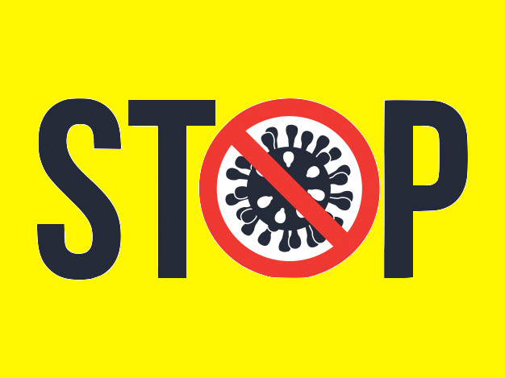
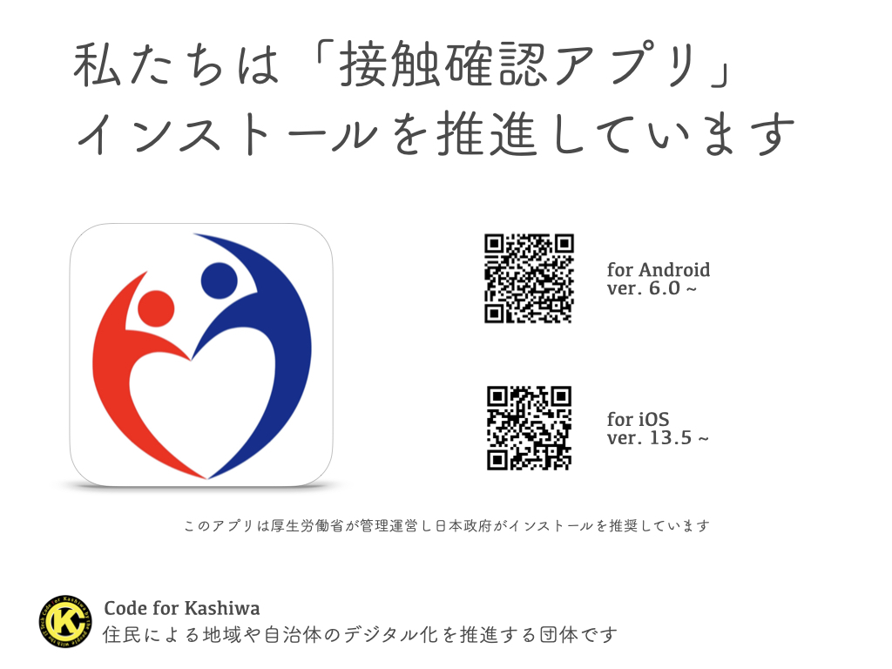
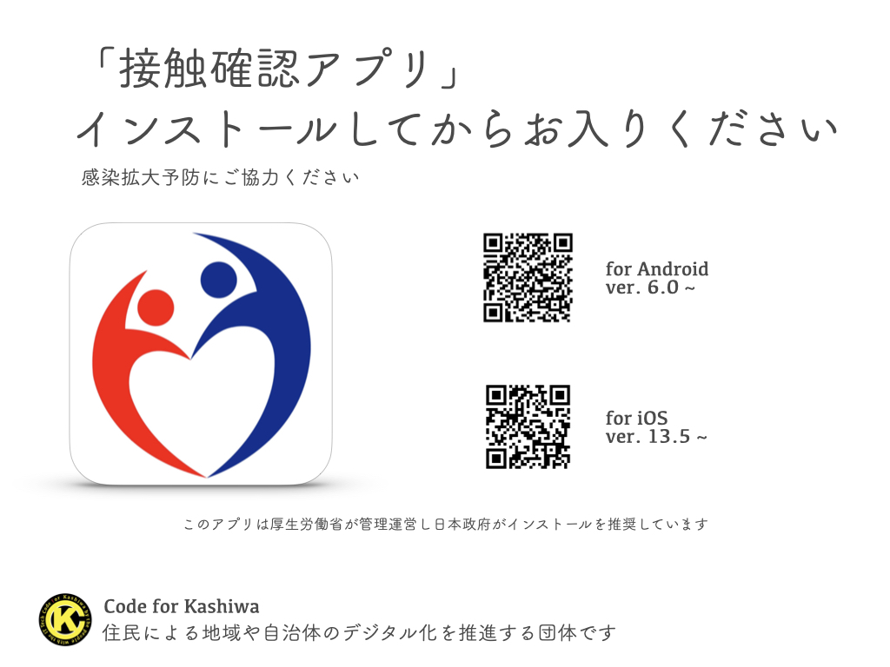

# ksw://Code for Kashiwa

## About Us
私たちは地域や行政のIT化を推進する協働グループです。
複雑化した社会、リアルタイムの対応が求められる社会の中で、地域のIT化が課題になってきていますが、良質なITサービスを実現するには人財・費用が多く求められます。行政や企業だけでは満足度の高いものは作れません。私たちが積極的に参加して、自分たちの意見を「集め」、住民みんなで「作る」ことが求められます。

私たちは住民が自ら行政と協働する「Civic Tech」の概念のもと活動を行います。

### 私たちは知識と技術を共有します
地域のIT化には知識が求められます。プロジェクトに関わる団体や部署の方々やIT技術に興味を持つ方に、基本的な知識や技術を体験を通して共有していきます。

### 私たちは提案します
経験や技術を持った住民・協力者によって、IT化の提案をします。
住民に関わる行政サービスや地域ITサービスなどに関しては、関係各所と協業して、よりユーザビリティの高いものを提供できるように活動を行います。

### 私たちは作ります
柏に住む人、柏に来る人、柏で働く人のために、地域サービスにアクセスしやすいWebシステムやアプリの制作をします。スピードのある対応を行うために独自のサービスを作り、このサービスで集められたデータは、公開し幅広く活用される「オープンデータ」を提供します。

### Civic Techとは？
シビック（Civic：市民）とテック（Tech：テクノロジー）をかけあわせた造語。市民自身が、テクノロジーを活用して、行政サービスの問題や社会課題を解決する取り組みをいう。

## Our Project

| |  |

## New Column
 - Twitter 新規陽性者お知らせ
  
  Code for KashiwaのTwitterアカウントで、新型コロナの新規陽性者を自動ツイートしています。
  <a href="https://twitter.com/code4kashiwa">@code4kashiwa</a>
  
 - LINE 新規陽性者お知らせ
  新規陽性者の情報が出たときにLINEチャットボットでお知らせします (現在登録者が増加し、無料枠を超えてしまい、通知ができない状況になっています。Twitterをご利用ください。)
  <a href="https://line.me/R/ti/p/%40336cfsja?fbclid=IwAR09NRHB3b8V4Os7SQ5HIpl4eoWcx-aU_2rXz8i9ga7m6gYEnF4J0-juWoI&h=AT0Z5mzyayHxGY0jmOSI57JRnxXUD0D4mJkBd9NwE-XQEH1g5hqYOZUg1i4jBq3bWvXKpt_ugGA64Ceo-X97rsaNGL0FOs3ILUNy_soYajYCYpqOQH5MREQ1OwfyVcewiuhmYAdlXNdCvdEIoLgzhdS7CZRio1WRWA">ここから登録</a>
   
 - 「接触確認アプリ」普及活動
 
  新型コロナウイルス感染拡大を防ぐために、厚生労働省がリリースした「接触確認アプリ」の普及を推進しています。こちらの画像を印刷して掲示のご協力をお願いいたします。
  
  
  
  

## 参加者募集
基本はslackで、コミュニケーションをとって進めています。たまに意識合わせやディスカッションのためにビデオ会議もすることがあります。

<a href="https://join.slack.com/t/code-for-kashiwa/shared_invite/zt-ftmrycdw-kK_tkHnzoITUpkMYsvhwMg">slack 参加申し込み</a>

プログラムができる方、デザインができる方、技術がわからなくても自分の生活をITで良くしたい方、地域とのパイプが太い方
全ての皆さんの力をフル活用して、柏の先進ギアを作りましょう！