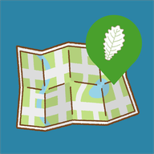

# ksw://Code for Kashiwa

## 柏の葉シビックマップ（柏の葉シビま）

千葉県柏市の柏の葉の住環境報告アプリです。ユーザの皆様から報告投稿をしてもらい、集まったデータでまちづくりの分析をしてもらうためのマップツールとして、Oak Leaf Project(代表:イシハラ)が開発し、Code for Kashiwaが運用しています。ユーザのプライバシーを保護し、個人を特定できるような仕組みを持ちません。大雨時の冠水場所や落とし物、ゴミのポイ捨ての場所など、さまざまなシチュエーションで利用できます。

アプリに関する問い合わせは下記のメールアドレス、または問い合わせフォームから内容を入力してください。

連絡先：code.for.kashiwa@gmail.com

<iframe src="https://docs.google.com/forms/d/e/1FAIpQLSebEIIYNCTp9XTV-h-kQ1bc90OZCEsDIbG_GD0PSA_y48BKpg/viewform?embedded=true" width="100%" height="857" frameborder="0" marginheight="0" marginwidth="0">読み込んでいます…</iframe>
